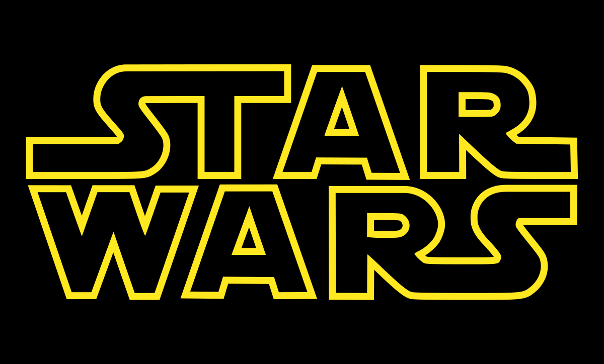

# Projeto StarWars - Fábrica de software

## Sobre o projeto
  É um projeto simples com uma tela de inicio com algumas informações sobre os filmes da saga Star Wars e uma outra tela com alguns personagens e suas caracteristicas que são requisitas de uma API.

API: "https://swapi.dev/api/people/"

## Tecnologias utilizadas
- JavaScript / React
- Vite
- Css
